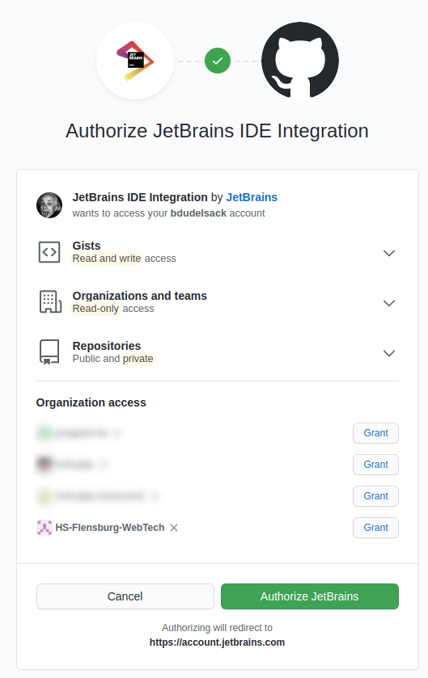

= Web- / Mobile-Technologien: Laboraufgabe I (KW 39)
Boris Dudelsack <boris.dudelsack@hs-flensburg.de>
1.0, 2021-09-20
:doctype: docbook
:source-highlighter: rouge
:source-language: kotlin
:rouge-style: monokai

== Projekt aus der Repository in JetBrains IDEA erstellen

Erstellen Sie in Jetbrains IDEA Projekt aus dieser Git Repository. Die IDE wird dabei den Zugang zu Ihrem GitHub Account erfragen.

**WICHTIG**: Gewähren Sie der IDE Zugriff zu der Organisation `HS-Flensburg-WebTech` in dem Sie auf den Button `Grant` neben den Namen der Organisation klicken.



== Datenklasse

Definieren Sie eine _Datenklasse_, die einen Studenten repräsentiert. Die Klasse soll `Student` heißen und
Eigenschaften `firstName`, `lastName` und `matriculationNumber` beinhalten.

```kotlin
data class Student( /* ... */ )
```
*TIPPS*:

* Die Matrikelnummer kann eine fortlaufende Zahl sein

== Listen

Erstellen Sie eine List mit den Vornamen und eine Liste mit den Nachnamen. Schreiben Sie eine Funktion namens
`generateRandomStudents`, die eine Liste mit zufällig generierten Studenten zurückgibt. Die Funktion soll
einen _Parameter_ übergeben bekommen, der die Größe der resultierenden Liste angibt.

*TIPPS*:

* Schauen Sie sich den Konstruktor der Klasse `List` an in Zusammenhang mit einer Lambda-Funktion
* Studierende mit gleichen Namen müssen nicht ausgefiltert werden

```kotlin
fun generateRandomStudents(n: Int): List<Student> {

}
```

== Map

Definieren Sie eine Funktion namens `scoreStudents`, die soll jedem Student eine zufällige Punktzahl zwischen 0 und 100 geben.
Die resultierende Noten sollen als `Map<Student, Int>` zurück gegeben werden.

*TIPPS*:

* https://kotlinlang.org/api/latest/jvm/stdlib/kotlin.random/-random/
* Erstellen Sie eine Liste von Paaren und benutzen Sie die Methode `Iterable<Pair<K, V>>.toMap()`

```kotlin
fun scoreStudents(students: List<Student>): Map<Student, Int> {

}
```

=== Methode: forEach

Geben Sie die Liste der Studenten mit den entsprechenden Punkten aus.

=== (Optional) Methode: toSortedMap

Finden Sie heraus, wie Sie mit der Hilfe der `toSortedMap`-Methode die Map sortieren können und geben Sie die Noten
in der absteigenden Reihenfolge aus.

== Tests mit Gradle ausführen

Diese Repository enthält automatische Tests, die Ihnen erlauben zu prüfen ob Sie die Aufgabe richtig gelöst haben. Finden Sie heraus wie Sie die Tests durch die IDE und aus der Console starten können.

== Gradle: Application Plugin

Fügen Sie der Gradle-Konfiguration das `application`-Plugin zu und überprüfen Sie ob der Gradle-Task `run` verfügbar ist. Konfigurieren Sie das Plugin wie in der Vorlesung vorgestellt wurde.

== Git: Commit und Push

Führen Sie ein Git Commit durch und pushen Sie Ihre Änderungen zu der GitHub Repository.