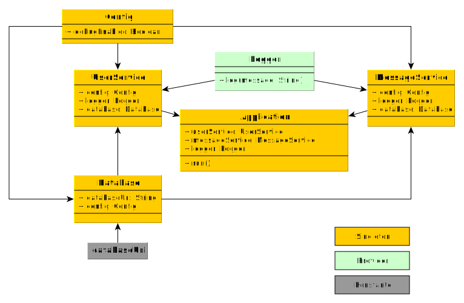

= Web- / Mobile-Technologien: Laboraufgabe IV (KW 43)
Boris Dudelsack <boris.dudelsack@hs-flensburg.de>
1.0, 2021-11-18

== Dependency Injection

Ihnen liegt eine vereinfachte Struktur einer Applikation vor. Implementieren Sie die Eigenschaften
der einzelnen Klassen und realisieren Sie die Abhängigkeiten mithilfe der `Kodein-DI`-Bibliothek.

