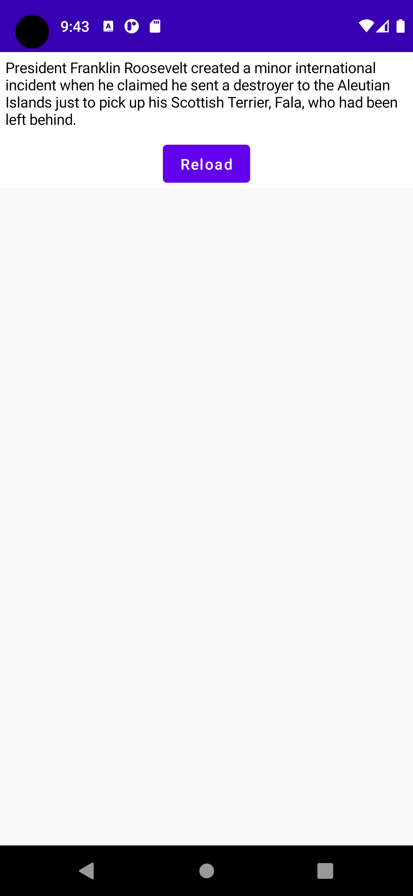

= Web- / Mobile-Technologien: Laboraufgabe IIX (KW 48)
Boris Dudelsack <boris.dudelsack@hs-flensburg.de>
1.0, 2021-11-23

== Jetpack Compose

== Beschreibung

Ihre Aufgabe besteht darin eine Anwendung zu programmieren, die Hundefakten über eine API bezieht und mit Hilfe von Jetpack Compose darstellt.

Beispiel:

=== Vorgehensweise

1. Implementieren Sie ein API-Client mit Hilfe von Ktor, der die Fakten über Hunde von `https://dog-facts-api.herokuapp.com/api/v1/resources/dogs?number=1` bezieht.
2. Erstellen Sie dafür eine Data-Klasse `DogFact`. Benutzen Sie die `kotlinx.serialization` für die Umwandlung.
3. Für die Ausführung der Couroutinen benutzen Sie den `lifecycleScope`
4. Programmieren Sie die Ansicht, die der Beispielabbildung entspricht.

*P.S* Du dieser Aufgabe gibt es keine automatisierte Tests.
