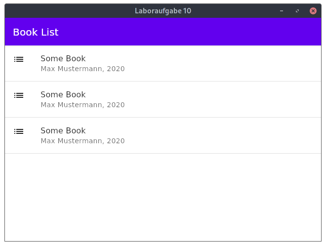

= Web- / Mobile-Technologien: Laboraufgabe X (KW 50)
Boris Dudelsack <boris.dudelsack@hs-flensburg.de>
1.0, 2021-12-07

== Compose for Desktop

In dieser Aufgabe geht es darum eine kleine Anwendung mit Hilfe von Compose for Desktop zu erstellen. Ihnen liegt ein Projekt vor, das bereits konfiguriert ist. Des weiterem ist eine Klasse `Book` definiert, die Sie verwenden sollen.

Erstellen Sie eine Liste von Büchern, die in dem globalen `AppState` gespeichert werden soll. Verwenden Sie den `Scaffold`-Layout und eine `TopAppBar` aus der `MaterialTheme` als Hauptlayout Ihrer Anwendung.

Die Liste der Bücher soll mit Hilfe von `ListItem` in einem `Column`-Layout realisiert werden und folgende Elemente enthalten:

- Titel des Buches
- Name des Authors und Jahr (durch Komma getrennt)
- Ein Icon (egal welches)

Sie können den `Divider`-Component vewenden um die Listenelemente voneinander zu trennen.

Am Ende sollen Sie folgende Ansicht bekommen:

*PS: Leider ist Compose für Desktop noch in der Entwicklung und es gibt momentan keine Möglichkeit automatisierte Tests zu realisieren. Orientieren Sie sich bei der Selbskontrolle auf den beigefügten Screenshot.*
